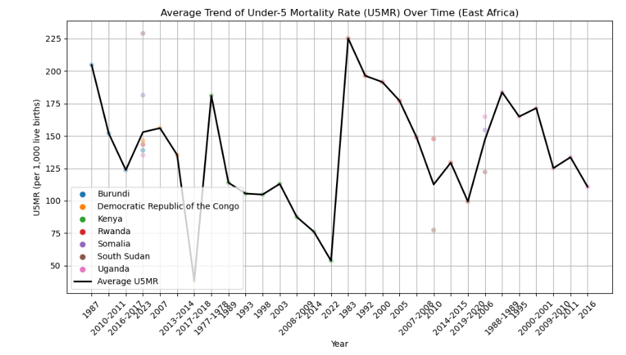
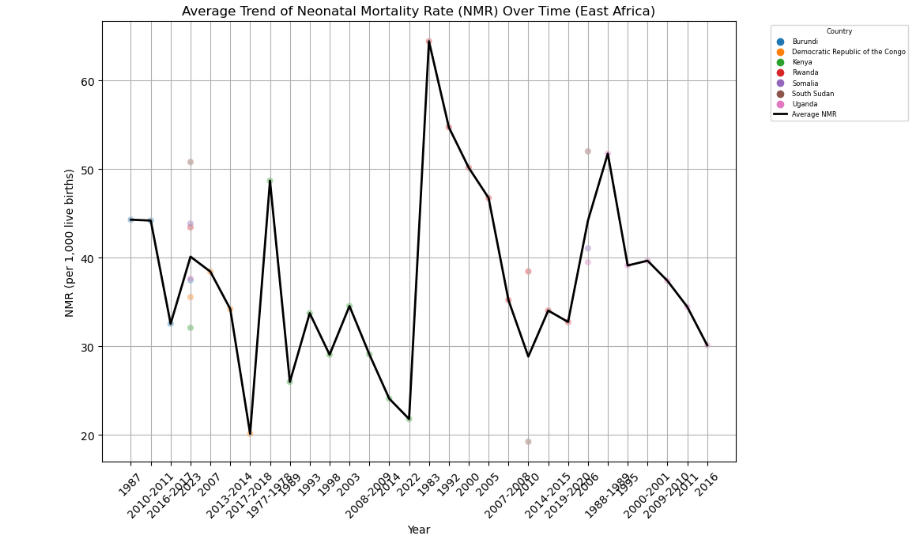

#  HIV DATA ANALYSIS

### PART A 

#### OVERVIEW

In the first part of the analysis we're provided with a dataset from the World Health Organization (WHO) Global Observatory, containing data on people living with HIV at the country level from 2000 to 2023.

From the data, we can analyze infection trends, inform healthcare service planning, and addressing persistent issues like stigma and inequity. 
Particularly for this task, I will use the data to track HIV infections in countries globally and WHO regions. 

I will then conclude with findings based on the visualizations plotted.

### Data Analysis 

The analysis will have two parts:
1. Visualization of HIV cases trends in countries that contribute to 75% of the global burden.

2. Visualization of HIV cases trends in countries that contribute to 75% of the global burden in each WHO region.

The analysis will begin with cleaning data, using pandas library to perform data imputation, matplotlib and seaborn for visualizations.

#### Data Cleaning 

```{python}
# Import necessary libraries
import pandas as pd
import matplotlib.pyplot as plt
import seaborn as sns
import re
import numpy as np
import statsmodels.formula.api as smf
import statsmodels.api as sm

```

#### Load the data 
```{python}
hiv_data= pd.read_csv('HIV data 2000-2023.csv' , encoding='latin1')
hiv_data.head()
```

Next, the info method is used to view the data and get insights into it. 

From it, we can see that the data has no missing values, the are only object and integer data types.

 We have countries that have missing data for the whole time period from 2000-2023 and those that have partially missing data.
 I dropped the countries that have complete missing data and computed for those that have partially missing data.
 
```{python} 
 
 # Replace 'no data' with NaN
hiv_data['Value'] = hiv_data['Value'].replace('No data', np.nan)


# Function to extract point estimate
def extract_point_estimate(value_str):
    if pd.isna(value_str):
        return np.nan
    match = re.search(r'(\d[\d\s]*)(?=\s*\[)', value_str)
    if match:
        return int(match.group(1).replace(" ", ""))
    return np.nan

# Apply to cleaned column
hiv_data['Value_Clean'] = hiv_data['Value'].apply(extract_point_estimate)


# Drop countries where Value_Clean is NaN for all years
hiv_data = hiv_data[hiv_data.groupby('Location')['Value_Clean'].transform('count') > 0]
```

##### Impute missing years for countries with partial data
```{python} 
# Fill missing values with forward then backward fill
hiv_data['Value_Clean'] = hiv_data.groupby('Location')['Value_Clean'].transform(lambda x: x.ffill().bfill())


country_total = hiv_data.groupby('Location')['Value_Clean'].sum().sort_values(ascending=False)
```
Find countries contributing to 75% of the global burden
```{python}
# Total burden
global_total = country_total.sum()
threshold = 0.75 * global_total

# Find top contributors cumulatively
cumulative = country_total.cumsum()
top_countries = cumulative[cumulative <= threshold].index.tolist()

print("Countries contributing to 75% of HIV burden:")
print(top_countries)
````

##### 1. Visualization of HIV cases trends in countries that contribute to 75% of the global burden.
```{python} 
# 5. Plot trends over time
plt.figure(figsize=(14, 8))
sns.lineplot(data=hiv_data_top_countries, x='Period', y='Value_Clean', hue='Location', palette='tab20', marker="o")
plt.title('Trend of HIV Cases in Countries Contributing to 75% of Global Burden')
plt.ylabel('Number of HIV Cases')
plt.xlabel('Year')
plt.legend(title='Country', bbox_to_anchor=(1.05, 1), loc='upper left')
plt.grid(True)
plt.xticks(range(2000, 2024, 1), rotation=45) 
plt.tight_layout()
plt.show()
```


From the graph, South Africa has had the highest number of HIV cases from 2000-2023 globally while Democractic Republic of the Congo has had a low steady rate of infections. India shows a consistent trend of infections through the years.


#### 2. Visualization of HIV cases trends in countries that contribute to 75% of the global burden in each WHO region.

```{python} 
# Group data by region
regions = hiv_data['ParentLocationCode'].unique()


for region in regions:
    hiv_data_region = hiv_data[hiv_data['ParentLocationCode'] == region]
    
    # Sum total burden per country within region
    country_burden_region = hiv_data_region.groupby('Location')['Value_Clean'].sum().sort_values(ascending=False)
    
    # Find countries contributing to 75% of regional burden
    total_burden_region = country_burden_region.sum()
    cumulative_region = country_burden_region.cumsum()
    top_countries_region = cumulative_region[cumulative_region <= 0.75 * total_burden_region].index.tolist()
    
    # Filter
    hiv_top_countries_region = hiv_data_region[hiv_data_region['Location'].isin(top_countries_region)]
    
    # Plot
    plt.figure(figsize=(10, 5))
    sns.lineplot(data=hiv_top_countries_region, x='Period', y='Value_Clean', hue='Location', marker="o")
    plt.title(f'HIV Cases Trend in {region} - Countries Contributing to 75% of Regional Burden')
    plt.ylabel('Number of HIV Cases')
    plt.xlabel('Year')
    plt.legend(title='Country', bbox_to_anchor=(1.05, 1), loc='upper left')
    plt.grid(True)
    plt.tight_layout()
    plt.show

```


The WPR West Pacific Region showed the highest rates in infection rates in its countries, with Vietnam recording the highest rates.


### Part B 
For the second part of the analysis, we've been provided with World Bank data on the multidimensional poverty headcount ratio, which includes factors such as income, educational attainment, school enrolment, electricity access, sanitation and drinking water.

###### Objectives 

Merge this dataset with the HIV data  and analyze the relationship between people living with HIV and multidimensional poverty, and the individual factors that contribute to the ratio. Ad account for the random effects(country, year)

Paragraph the findings 
```{python} 
multidimensional_pov= pd.read_excel('multidimensional_poverty.xlsx', header=1)

multidimensional_pov
```

##### Data cleaning 
We first set the column names correctly for analysis.

```{python} 
# Get the new column names from row 0 (Monetary (%) to Sanitation (%))
new_columns = multidimensional_pov.iloc[0, 9:15].tolist()  # Positions 10 to 15

all_columns = (
    multidimensional_pov.columns[:9].tolist() +  # First 9 original columns
    new_columns +              # 5 new names for columns 9-13
    multidimensional_pov.columns[15:].tolist()   # Remaining columns (14 onwards)
)

# Assign the new column names
multidimensional_pov.columns = all_columns


# Drop row 0 since we've used it for partial column names
multidimensional_pov = multidimensional_pov.drop(0)

# Reset the index 
multidimensional_pov = multidimensional_pov.reset_index(drop=True)

# Display the cleaned DataFrame
multidimensional_pov
```
###### Merge HIV_dataset with multidimensional_poverty data
```{python}
hiv_multidimensional = hiv_data.merge(
    multidimensional_pov,
    left_on='SpatialDimValueCode',
    right_on='Country code',
    how='left'
)


hiv_multidimensional
```

###### Analyze relationship between people living with HIV and multidimensional poverty.

The correlation value: 0.46 is close to 1, indicates a moderate positive correlation between the estimated number of people living with HIV and the multidimensional poverty headcount ratio. 

This suggests that, in general, as poverty levels increase, the number of people living with HIV also tends to increase. However, the relationship is not very strong, implying that poverty is not the only factor influencing HIV prevalence. 

```{python}
# 1. Correlation Analysis
correlation = hiv_multidimensional['Value_Clean'].corr(hiv_multidimensional['Multidimensional poverty headcount ratio (%)'])
print(f"Correlation between HIV and Poverty: {correlation:.2f}")

Correlation between HIV and Poverty: 0.46
```


```{python}
# 2. Scatter Plot
plt.figure(figsize=(10, 6))
sns.scatterplot(data=hiv_multidimensional, x='Value_Clean', y='Multidimensional poverty headcount ratio (%)')
plt.title('HIV Prevalence vs. Multidimensional Poverty')
plt.xlabel('Estimated number of people living with HIV')
plt.ylabel('Multidimensional Poverty Headcount Ratio (%)')
plt.show()
```


The scatter plot visually represents this relationship. Each point on the plot represents a data point (a country or region) with its corresponding values for HIV prevalence and poverty.

The upward trend of the points from left to right confirms the positive correlation.
The spread of the points indicates that the relationship is not perfectly linear; there is some variability.
In summary, the analysis suggests a connection between HIV prevalence and poverty, but other factors are also likely to play a significant role. 


```{python}
if 'Multidimensional poverty headcount ratio (%)' in hiv_multidimensional.columns:
    hiv_multidimensional = hiv_multidimensional.rename(columns={'Multidimensional poverty headcount ratio (%)': 'multidimensional_poverty_ratio'})


if 'Country code' in hiv_multidimensional.columns:
    hiv_multidimensional = hiv_multidimensional.rename(columns={'Country code': 'Country_code'})
    

hiv_multidimensional["multidimensional_poverty_ratio"].replace([np.inf, -np.inf], np.nan, inplace=True)
clean_data = hiv_multidimensional.dropna(subset=["multidimensional_poverty_ratio"])  # Drop NaN


# random effects regression
model_re = sm.MixedLM(
    clean_data["Value_Clean"],
    clean_data[["multidimensional_poverty_ratio"]],
    groups=clean_data["Country_code"]
).fit()
print(model_re.summary())
print(model_re.summary())

# 4. Grouped analysis by poverty levels
poverty_bins = pd.qcut(hiv_multidimensional['multidimensional_poverty_ratio'], q=3, labels=['Low Poverty', 'Medium Poverty', 'High Poverty'])
grouped_df = hiv_multidimensional.groupby(poverty_bins)['Value_Clean'].mean().reset_index()

plt.figure(figsize=(8, 6))
sns.barplot(x='multidimensional_poverty_ratio', y='Value_Clean', data=grouped_df)
plt.title('Average HIV Prevalence by Poverty Level')
plt.xlabel('Poverty Level')
plt.ylabel('Average Estimated number of people living with HIV')
plt.show()
```


Significant poverty ratio: For every 1-unit increase in multidimensional_poverty_ratio, HIV case counts (Value_Clean) increase by 8,812.113 (p < 0.001).
The 95% confidence interval [6,278.8, 11,345.4] confirms this effect is robust (does not include zero).

Model fit: converged successfully no warnings.Log-Likelihood: -9,151.5 (useful for comparing nested models, but standalone interpretation is limited).

Group variability: Huge between-country variance (1.18e+11), suggesting HIV counts differ substantially across countries beyond what poverty explains.
This justifies using a mixed-effects model (fixed effect for poverty + random intercepts for countries).


### MORTALITY RATES ANALYSIS
We have been provided with data on the under-five mortality rate and neonatal mortality rate for the African region, which has been downloaded from the UN Inter-agency Group for Child Mortality Estimation. 

##### Objectives 

1. Filter data for the eight countries belonging to the East African Community.

2. Visualize the latest estimate of each indicator at the country level using shapefiles.

3. Show the average trends in the mortality rates over time (plot the average trend line and add the points in the graphic for the country level estimates for each indicator).

4. Based on the visualizations, identify the countries with the highest under-five mortality rates in East Africa and the highest neonatal mortality.

##### Data Cleaning
```{python}
#load the necessary libraries
import pandas as pd
import numpy as np
import matplotlib.pyplot as plt
%matplotlib inline
import geopandas as gpd
import seaborn as sns 
import os
```
```{python}
#load data

INR = pd.read_csv('dataset_datascience.csv', encoding='latin1', low_memory=False)

INR
```

##### 1. Filter data for the eight countries belonging to the East African Community.

```{python}
# Filter for EAC countries 
eac_countries = ["Burundi", "Kenya", "Rwanda", "South Sudan", "Tanzania", "Uganda", "Democratic Republic of the Congo", "Somalia"]
eac_inr_data = INR[INR["Geographic area"].isin(eac_countries)]
```

I dropped the Regional group, Country notes and Definition columns since it contains null data. 
```{python}
# Drop Regional group, country notes and definition
columns_to_drop = ['Regional group', 'Country notes','Definition']
eac_inr_data_dropped = eac_inr_data.drop(columns=columns_to_drop, axis=1)
eac_inr_data_dropped
```

##### 2. Visualize the latest estimate of each indicator at the country level using shapefiles
```{python}
# Merge with the shapefile
eac_gdf_with_data = eac_gdf.merge(
    latest_data,
    left_on='GID_0',
    right_on='REF_AREA',
    how='left'
)


eac_gdf_with_data
```

 Filter only Under-5 mortality
```{python}
u5mr_data = eac_gdf_with_data[eac_gdf_with_data['Indicator'] == 'Under-five mortality rate']

u5mr_data
```
#### Plotting mortality rates map

```{python}
# Plot Under five mortality rate map
fig, ax = plt.subplots(1, 1, figsize=(9, 5))
u5mr_map.plot(column='Observation Value', cmap='OrRd', legend=True, ax=ax, edgecolor='black')
ax.set_title('Under-5 Mortality Rate (U5MR) - Latest Estimate (Average)')
ax.axis('off')
plt.show()


# --- Prepare Neonatal Mortality Rate (NMR) data ---

nmr_data = eac_gdf_with_data[eac_gdf_with_data['Indicator'] == 'Neonatal mortality rate']

# Group by country (Location) and take mean Observation value
nmr_data_grouped = nmr_data.groupby('Geographic area', as_index=False)['Observation Value'].mean()

# Merge back with geometry
nmr_map = eac_gdf_with_data[['Geographic area', 'geometry']].drop_duplicates().merge(nmr_data_grouped, on='Geographic area', how='inner')

# Plot neonatal mortality rate map
fig, ax = plt.subplots(1, 1, figsize=(9, 5))
nmr_map.plot(column='Observation Value', cmap='PuBu', legend=True, ax=ax, edgecolor='black')
ax.set_title('Neonatal Mortality Rate (NMR) - Latest Estimate (Average)')
ax.axis('off')
plt.show()
```


The darker shaded areas show high numbers of estimate for the indicator. 

From the maps, it shows that Somalia and South Sudan has the highest estimate for the Under-five mortality rate. 

In the NMR map; Somalia, Rwanda and South Sudan show the highest record of neonatal mortality rate.


###### Show the average trends in the mortality rates over time (plot the average trend line and add the points in the graphic for the country level estimates for each indicator.

```{python}
# --- Plot U5MR ---
plt.figure(figsize=(10,6))

# Plot individual country points
sns.scatterplot(data=eac_pivot, x='Series Year', y='U5MR_value', hue='Geographic area', alpha=0.4, legend=False)

# Plot the average trend
sns.lineplot(data=eac_pivot.groupby('Series Year')['U5MR_value'].mean().reset_index(),
             x='Series Year', y='U5MR_value', color='black', linewidth=2, label='Average U5MR')

# Finalize plot
plt.title('Average Trend of Under-5 Mortality Rate (U5MR) Over Time (East Africa)')
plt.ylabel('U5MR (per 1,000 live births)')
plt.xlabel('Year')
plt.grid(True)
plt.xticks(rotation=45)  # Rotate x-axis labels for better readability
plt.locator_params(axis='x', nbins=10)  # Only show ~10 ticks on x-axis
plt.legend()
plt.tight_layout()
plt.show()

#eac_pivot.replace([np.inf, -np.inf], np.nan, inplace=True) 

# Drop rows with NaN in U5MR or NMR values
eac_pivot = eac_pivot.dropna(subset=['U5MR_value', 'NMR_value'])

# --- Plot NMR ---
plt.figure(figsize=(10,6))

# Plot individual country points
sns.scatterplot(data=eac_pivot, x='Series Year', y='NMR_value', hue='Geographic area', alpha=0.4, legend=False)

# Plot the average trend
sns.lineplot(data=eac_pivot.groupby('Series Year')['NMR_value'].mean().reset_index(),
             x='Series Year', y='NMR_value', color='black', linewidth=2, label='Average NMR')

# Finalize plot
plt.title('Average Trend of Neonatal Mortality Rate (NMR) Over Time (East Africa)')
plt.ylabel('NMR (per 1,000 live births)')
plt.xlabel('Year')
plt.grid(True)
plt.xticks(rotation=45)  # Rotate x-axis labels for better readability
plt.locator_params(axis='x', nbins=10)  # Only show ~10 ticks on x-axis

plt.legend()
plt.tight_layout()
plt.show()
``` 



From the Under-five mortality rates, the average trend line shows that the Democratic Republicof the Congo shows the highest rates of mortality in 1983 with 225 deaths per 1,000 live births.



For the Neonatal mortality rates, the Democratic Republic of the Congo shows highest rates of mortality rates in 1983 with approximately 67 deathes per 1,000 live births.


